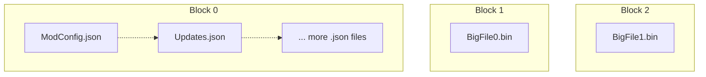

---
hide:
  - toc
---

	<h1>The .r3a Archive Format</h1>
	
	   
    High Performance File Format
     
    For <i>Loading</i> and <i>Sharing</i> Mods.  
    
    

## About

The Reloaded 3 Archive (`.r3a`) format is a semi-SOLID archive format, using *modern* compression technologies such as
[ZStandard] and [LZ4] under the hood.

Between size optimized SOLID archives like `.7z` w/ `LZMA` and non-SOLID archives like `.zip` w/ `Deflate`,
the `.r3a` format bridges the gap; reaping most of the benefits from both worlds.

R3A aims to be a simple format, appropriate for both local storage of mods and for downloading from the web.

## Characteristics

!!! info "What can you expect from R3A?"

- High Performance (constrained by RAM speeds, bottlenecks any NVMe)
- File Sizes between `.zip` and `.7z`.
- Lightweight Dependencies
- Dictionary Compression
- Self Contained Format
    - e.g. Copy of Dictionaries used always available in archive if not available.
- Low Latency File Access
- Partial Downloads
- Optimized for Fast Parsing (Whole Header in Front, with Chunk Size)
- Hardened for Server Usage (by default)
    - Passes [miri] (memory safety & no undefined behaviour).
    - Tests cover all known possible invalid memory acceeses.
    - Can disable client side via feature if you trust the data for parsing speedups.

## Ways to use R3A

!!! info "These are available as 'presets' in the R3A API"

### For ***Archiving*** Mods

For storage of mods:

- Use standard 16MiB SOLID Blocks to save space by grouping small files together.
- Chunk large files using >128MiB blocks where compression efficiency deficit is negligible.
- Use Dictionary Compression for small SOLID blocks.

This basically turns the format into a ZStandard based archive with per-file multithreading
& per-chunk for huge files.

### For ***Read Only File Systems***

- Use dictionary compression for instant access to files.
- Use no SOLID blocks
- Use small chunks (128KiB) for large files.

This gets you multithreaded decompression for files of any size, and minimal latency for tiny files.

### For ***Hosting*** Mod Downloads

For hosting mod downloads:

- Use non-SOLID blocks
- R3A blocks can be deduplicated server side, avoiding duplicate data between mod versions in CDN.
- No dictionary compression (unless standardised).

With R3A, users can perform partial file downloads, only downloading the actual files which have
changed between the current version of the archive and the last version of the archive.

## Where is R3A used?

!!! info "In [Reloaded3] for mod packaging"

    For distributing mods on mod websites, either as R3A directly, or R3A wrapped in a `.zip` container.

## Why Rust?

!!! info "I originally designed and created the predecessor of R3A as 'Nx' for the [Nexus Mods App]"

The transition to Rust here is mainly for *technical reasons* involving my own required use cases.

- .NET cannot be safely used for hooking Operating System APIs.
    - This is due to [GC Transitions].
    - I need this for building R3A Accelerated ***Virtual File Systems***.

- The [Reloaded3 Project][r3-code-guidelines] requires more portability than what .NET targets.
    - R3 aims to support esoteric platforms like embedded devices and consoles wherever possible.
    - `.NET` (C#) is not available on these platforms, but LLVM (and thus Rust) often are.
    - Using [NativeAOT] would massively bloat the binary size.
    - The rest of the R3 ecosystem is in Rust, which leads to binary savings thanks to code reuse.

## Technical Questions

If you have technical questions, direct them to library & docs author [@Sewer56][Sewer56]
via one of these methods:

- [Open an Issue][open-issue]

Happy Hacking ❤️

[ZStandard]: http://facebook.github.io/zstd/
[LZ4]: http://lz4.github.io/lz4/
[Nexus Mods App]: https://github.com/Nexus-Mods/NexusMods.App
[r3-code-guidelines]: https://reloaded-project.github.io/Reloaded-III/Code-Guidelines/Code-Guidelines.html#1-use-no_std-as-a-foundation
[GC Transitions]: https://github.com/dotnet/runtime/issues/82684#issue-1600116291
[NativeAOT]: https://learn.microsoft.com/en-us/dotnet/core/deploying/native-aot/?tabs=net7%2Cwindows
[Virtual File Systems]: https://reloaded-project.github.io/Reloaded-III/Mods/Essentials/Virtual-FileSystem/About.html
[Sewer56]: https://github.com/Sewer56

[open-issue]: https://github.com/Sewer56/sewer56-archives-r3a/issues/new
[Reloaded3]: https://reloaded-project.github.io/Reloaded-III/
[miri]: https://github.com/rust-lang/miri