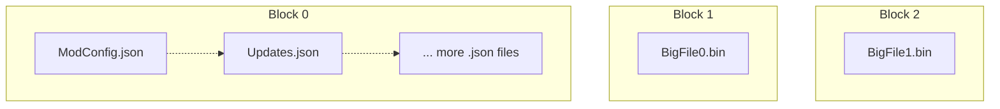

# Format Specification

!!! tip "File Format Version: `2.0.0`"

!!! note

    This is a semi-SOLID archive format for storing game mod content; intended to double up as a packaging format for uploading mods.

It has the following properties:

- Files under Block Size are SOLID Compressed.
- Files above Block Size are non-SOLID Compressed.
- Variable Block Size.
- Stores File Hashes Within.
- Huge Files Split into Chunks for Faster (De)compression.
- TOC in-front.

We use SOLID compression to bundle up small files together, while keeping the large files as separate compressed blobs.
All files are entirely contained within a slice of a given block.



Offsets of each block is stored in header, therefore large files can be completely skipped during the extract operation
if a small file is all that is needed.

!!! note

    This format is optimized for transferring and unpacking files; editing existing archives might lead to sub-optimal performance.

## Overall Format Layout

The overall file is structured in this order:

```
| Header + TOC | Block 1 | Block 2 | ... | Block N |
```

All sections (indicated by `|`) are 4096 aligned to match physical sector size of modern drives and page granularity.

Field sizes used below are similar to Rust notation; with some custom types e.g.

- `u8`: Unsigned 8 bits.
- `i8`: Signed 8 bits.
- `u4`: 4 bits.
- `u32/u64`: 4 Bytes or 8 Bytes (depending on variant).
- `align8`: Add 0-7 padding bytes to align the current address to multiple of 8.

Assume any bit packed values are sequential, i.e. if `u4` then `u4` is specified, first `u4` is the upper 4 bits.

All packed fields are `little-endian`; and written out when total number of bits aligns with a power of 2.

- `u6` + `u12` is 2 bytes `little-endian`
- `u15` + `u17` is 4 bytes `little-endian`
- `u26` + `u22` + `u16` is 8 bytes `little-endian`
- `u6` + `u11` + `u17` ***is 4 bytes*** `little-endian`, ***not 2+2***

### Terminology

- `Block`: Represents a compressed section of data of any size smaller than [chunk size](./File-Header.md#chunk-size).
- `Chunk`: A `block` that corresponds to a slice of a file.
    - A file compressed in a single `block` is said to have 1 chunk.
    - A file compressed in multiple `block`(s) is said to have multiple chunks.

## Use as Packaging Format

!!! tip

    Inclusion of hash for each file has some nice benefits.

- Can do partial download to upgrade from older version of mod.
    - We can download header (incl. [Table of Contents][ToC Header]) only, compare hashes.
    - Then only download the chunks we need to decompress our needed data.
    - Inspired by MSIX and certain Linux package formats.

- Certain applications like [Nexus Mods App] can avoid re-hashing files.

## Previewing the Format

!!! info

    For people wishing to study the format, or debug it, a [010-Editor](https://www.sweetscape.com/010editor/) template
    is available for usage [010 Template](./010Template.bt).

Hit `Templates -> Open Template` and then the big play button.
Then you'll be able to browse the format in 'Variables' window.

Alternatively, contributions are welcome if anyone wants to make a [Kaitai Struct](https://kaitai.io) variation 💜.

## Section Alignment

!!! info "Each section is aligned to the following values in bytes"

    For arrays, this lists alignment for each entry.

- [File Header][File Header]: 8

Table of Contents:

- [ToC Header][ToC Header]: 8
- [FileEntry[FileCount]][FileEntry]: 4 / 8 (Depends on ToC [Version])
- [Blocks[BlockCount]][Blocks]: 4
- [StringPool][StringPool]: 4

Dictionary Info:

- `align8`: 0-7
- [Dictionary Header][Dictionary Header]: 8

User Data:

- `align8`: 0-7
- [User Data Header][User Data Header]: 8

## Compressor Settings

!!! warning "Nx uses non-standard zstandard compressor settings"

    For more details, see [Stripping ZStandard Frame Headers]

## Version History

!!! info "This is the version history for the file format, not the reference implementation/library."

***To view the file format specification for a given version, navigate to the linked commit
for each version and read this specification.***

### 2.0.0

!!! info "Initial Release, in Rust"

    Version in header is updated to 1.

***THIS IS A WIP. REST OF SPEC IS NOT YET UPDATED TO ACCOUNT FOR THIS***

- Hashing algorithm replaced with [XXH3] (from [XXH64][XXH3]).
- Support for per-extension dictionaries.
- Implementation of User Data Segment in reference implementation.
- Added `Section Alignment` section to docs.


#### Implementation of User Data Segment

!!! info "The `User Data Segment`, proposed in 1.X docs is finalized and implemented."

Example use cases:

- Storing a binary baked-in hashtable to quickly find files by name.
- Storing update information for a mod package if Nx is used to power a package manager.
- Storing file metadata (read/write timestamps, file permissions, etc.)

#### Support for Dictionary Compression

See [Dictionaries]. The Nx format now supports the usage of zstd dictionaries to compress
data within the archive. Some extra info can be found in [Research: Dictionaries] and [Research: Decode Speed].

You can now opt in to train data on small files included within the archive, and use
that same dictionary to compress said files. The dictionary will be stored in the header of the
archive.

#### Hashing Algorithm Change

The hashing algorithm has been changed to [XXH3] from [XXH64][XXH3].

This is a hard change because [XXH3] is superior in just about all use cases.
The format originally intended to use [XXH3], however the [Nexus Mods App] opted
to go with `XXH64` instead.

The original intent was that you'd take the hash of each file from the archive and get hashes
'for free' (no I/O bottleneck). However the design changed.

Since the [Nexus Mods App] does not make use of the hashes in the archives (outside of GC), the archive
format is migrating to [XXH3] as standard.

#### Stripping Zstandard Frame Headers

Nx format now skips the Zstandard frame headers, namely zstd compressed sections are now compressed with the
following settings:

```
- ZSTD_c_format = ZSTD_f_zstd1_magicless
- ZSTD_c_contentSizeFlag = 0
- ZSTD_c_checksumFlag = 0
- ZSTD_c_dictIDFlag = 0
```

This reduces the size of each block by 12 bytes, as the magic number (4 bytes),
block size (typically 4 bytes) and checksum (4 bytes) are skipped.

The removal of the checksum flag also speeds up decompression a tiny bit.
In cases where a decompressed size is needed, such as in decompression,

#### Added Packing Presets

!!! info "This release adds various packing presets to the reference API implementation."

The presets control the behaviour of how the blocks in the `.nx` archive are arranged.
They currently include:

- Local Archiving (SSD): Maximized Compression ratio with LZMA.
- Local Archiving (NVMe): Compression at ZStandard Max Level.
- Web Uploads (Generic): Maximized Compression ratio with BZip3.
- Web Uploads (No SOLID): BZip3. For websites which wish to optimize their storage of Nx archives.
  - Split up Nx archives into blocks.
  - Store them deduplicated on CDN.
  - Reassemble archives upon user downloading a file.
  - That allows mod updates to not double up storage server side.
- Game Bulk Load: Compression with tweaked ZStandard Options for slightly better decompression speed.
  - Use for loading multiple game files at once. e.g. a Stage
- Low Latency VFS: Optimizes for low latency access of unknown data with small compression ratio sacarifice.

#### Added BZip3 Compression

!!! info "Added BZip3 Compression for Web Uploads"

!!! warning "BZip3 is still experimental, and contains bugs."

    It's still an experiment for now, it may be removed at a later date.

[BZip3] is a relatively new algorithm for compressing data. Among the high compression algorithms
that still have 'acceptable' decompression speeds, this one comes out as the one compressing the best
on texture data. Justification for trying [BZip3] is below.

According to [Steam Hardware Survey] largest bucket of users has a 6-core CPU.

While the exact CPU is not specified, it is likely that this is of the class around Ryzen 5600
or Intel 12600K. That should be approximately half of the performance of my 5900X.

On my CPU, all thread decompression runs at around 125MB/s, so expect in around 60MB/s there, and 10MB/s
on a single thread. Minor optimizations are also still possible, of course.

On the [Steam Download Stats] page we can see that the top countries average around 150Mbps (18.75MB/s) today.
Take into account a 1.4-ish compression ratio, we can extrapolate that a regular user should be able
to decompress while downloading on 3 cores.

[For some miscellaneous tests/notes, see issue 20][issue-20].

!!! info "BZip3 also has a lot of opportunity to improve still"

    There's plenty of opportunities for tiny optimizations all around.

#### Added LZMA Compression

!!! info "Added LZMA Compression for Local SSD Archiving"

LZMA (known from 7zip / Igor Pavlov) is used for archiving local data to non-NVMe storage.

On modern hardware, this achieves around 70MB/s of decompression speed per thread; exact scaling
across multiple cores is currently unknown (TODO: update this), but it is hoped that on current
hardware, it should exceed 500MB/s on 12 cores. Read speed limit of SATA SSDs is around 550MB/s, but
tends to commonly be closer to 500MB/s.

Accounting for a 1.4x compression ratio, a machine would need ~700MB/s decompression speed to max
out the drive. A 7950X (16 core, 2022), 14900k (2022) or faster should be able to saturate this.

When a the web upload preset is chosen, and there are very few blocks generated, the preset will
fall back to LZMA. This improves decompression speed 5-7x, so updates to individual files on fast
internet connections wouldn't be held back.

#### String Pool Experiment

!!! info "An alternative implementation of the [String Pool] was experimented with."

It speeds up from around 89us to 67us, however ***the format will not use it***, as it increases binary size
considerably. The format was a variation of the pool where the buffer starts with an array of `u8`
containing the path lengths. The strings following naturally.

[VPrefix Pool Benchmark Numbers]

### 1.1.0

!!! info "Revisions of the Spec"

    This is a minor revision of the spec which tightens some assumptions about the format.
    Last commit with 1.1.0 version: [3fc966ff5c352ac7a9b7360beb25988a6c9ef15c](https://github.com/Nexus-Mods/NexusMods.Archives.Nx/commit/3fc966ff5c352ac7a9b7360beb25988a6c9ef15c)

This does not increment the version in the header. There are no changes in the actual format itself,
just that certain behaviours of the reference implementation are being standardised into the spec.

Version in header remains 0.

#### Tightened String Pool Assumptions

The [String Pool] is now assumed to have a number of items equivalent to the amount
of files which are stored in the Table of Contents. In other words, [FileCount] == `NumOfItemsInPool`.

This was already the case previously, but now this is part of the spec.

!!! tip "This allows for faster parsing of pool"

### 1.0.0

!!! info "Initial Release"

    Last commit with 1.0.0 version: [196d116d09cd436818dfd596e069eaef2b7a616d](https://github.com/Nexus-Mods/NexusMods.Archives.Nx/commit/196d116d09cd436818dfd596e069eaef2b7a616d)

Dated 21st of July 2024, this marks the 'initial release' as `1.0.0`.

#### File Header Changes

This release removes the `Block Size` (u4) field from the header, as this can vary
per block and with the use of features such as deduplication and archive merging.
It was also not used in the reference implementation anywhere.

Instead, the `Chunk Size` field is extended to 5 bits and the header page count to
15 bits. This allows the [chunk size](./File-Header.md#chunk-size) to be in range
of `512 bytes` to `1 TiB`. (Previous range `32K` - `1GiB`)

The version field is repurposed. In the previous version, it was used to indicate
the version of the table of contents. Now that is moved to the actual table
of contents itself. The version field is now used to indicate incompatible changes
in the format itself. This field is `u7`. The previous field, was moved to the actual
[Table of Contents](./Table-Of-Contents.md) itself.

The `Header Page Count` field is extended to 16 bits, allowing for a max size of
256MiB. This allows for storage of [arbitrary user data][User Data Header]
as part of the Nx header. A reserved, but not yet implemented section for
[User Data][User Data Header] was also added to the header.

The [Table of Contents][ToC Header] has also received its own proper
'size' field. Which led to some fields being slightly re-organised.

[Version]: ./Table-Of-Contents.md
[String Pool]: ./Table-Of-Contents.md#string-pool
[FileCount]: ./Table-Of-Contents.md#filecount
[XXH3]: https://xxhash.com/
[Nexus Mods App]: https://github.com/Nexus-Mods/NexusMods.App
[FileEntry]: ./Table-Of-Contents.md#file-entries
[ToC Header]: ./Table-Of-Contents.md
[Blocks]: ./Table-Of-Contents.md
[StringPool]: ./Table-Of-Contents.md#string-pool
[File Header]: ./File-Header.md
[User Data Header]: ./User-Data.md
[VPrefix Pool Benchmark Numbers]: https://github.com/Sewer56/sewer56-archives-nx/issues/3#issuecomment-2347143581
[Dictionaries]: ./Dictionaries.md
[Research: Dictionaries]: ../Research/DictionaryCompression.md
[Research: Decode Speed]: ../Research/DecodeSpeed.md
[Stripping ZStandard Frame Headers]: #stripping-zstandard-frame-headers
[Dictionary Header]: ./Dictionaries.md
[issue-20]: https://github.com/Sewer56/sewer56-archives-nx/issues/20
[Steam Hardware Survey]: https://store.steampowered.com/hwsurvey/cpus/
[Steam Download Stats]: https://store.steampowered.com/stats/content/
[BZip3]: https://github.com/kspalaiologos/bzip3