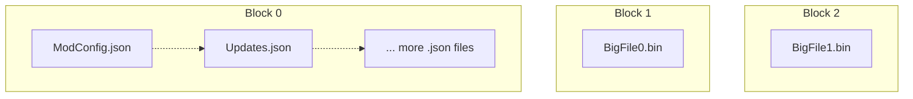

---
hide:
  - toc
---

	<h1>The .nx Archive Format (Rust Edition)</h1>
	
	   
    High Performance File Format
     
    For <i>Loading</i> and <i>Sharing</i> Mods.  
    
    

## About

The Nexus (`.nx`) format is a semi-SOLID archive format, using *modern* compression technologies such as
[ZStandard] and [LZ4] under the hood.

Between size optimized SOLID archives like `.7z` w/ `LZMA` and non-SOLID archives like `.zip` w/ `Deflate`,
the `.nx` format bridges the gap; reaping most of the benefits from both worlds.

Nx aims to be a simple format, appropriate for both local storage of mods and for downloading from the web.

## Motivations

!!! question "Why does Nx exist?"

- For ***Fast Random Access***

Nx uses ***small*** SOLID blocks, for grouping ***small*** files where SOLID compression matters the ***most***. 
Large files can be split up into multiple blocks, with parallel decompression.

Combine with single core [LZ4] and [ZStandard] algorithms for *decent* random access speeds.

- For ***Reducing Storage Sizes***

For longer term archival; Nx is designed to bring top of the line compression to filesystems that don't support it. 
Wouldn't it be cool to store your mods compressed? I think so.

- For ***File Downloads***

This format allows us to do partial downloads of mods.
If only a few files in a mod were updated; why should you need to download the entire thing again?

!!! nexus "In the [Nexus Mods App]"

    Nx was originally designed by me for the [Nexus Mods App]; to allow
    recompressing of legacy uploaded mods for faster deployment and re-deployment.

And of course, for the community ❤️ 😺.

## Why Rust?

!!! info "I originally designed and created Nx for the [Nexus Mods App]"

The transition to Rust here is mainly for *technical reasons* involving my own required use cases.

- .NET cannot be safely used for hooking Operating System APIs.
    - This is due to [GC Transitions].
    - I need this for building Nx Accelerated ***Virtual File Systems***.

- The [Reloaded3 Project][r3-code-guidelines] requires more portability than what .NET targets.
    - R3 aims to support esoteric platforms like embedded devices and consoles wherever possible.
    - `.NET` (C#) is not available on these platforms, but LLVM (and thus Rust) often are.
    - Using [NativeAOT] would massively bloat the binary size.
    - The rest of the R3 ecosystem is in Rust, which leads to binary savings thanks to code reuse.

## Technical Questions

If you have technical questions, direct them to library & docs author [@Sewer56][Sewer56]
via one of these methods:

- [Open an Issue][open-issue]
- [Nexus Mods App Discord][nma-discord]

Happy Hacking ❤️

[ZStandard]: http://facebook.github.io/zstd/
[LZ4]: http://lz4.github.io/lz4/
[Nexus Mods App]: https://github.com/Nexus-Mods/NexusMods.App
[r3-code-guidelines]: https://reloaded-project.github.io/Reloaded-III/Code-Guidelines/Code-Guidelines.html#1-use-no_std-as-a-foundation
[GC Transitions]: https://github.com/dotnet/runtime/issues/82684#issue-1600116291
[NativeAOT]: https://learn.microsoft.com/en-us/dotnet/core/deploying/native-aot/?tabs=net7%2Cwindows
[Virtual File Systems]: https://reloaded-project.github.io/Reloaded-III/Mods/Essentials/Virtual-FileSystem/About.html
[Sewer56]: https://github.com/Sewer56
[nma-discord]: https://discord.gg/ccSndYpypC
[open-issue]: https://github.com/Sewer56/sewer56-archives-nx/issues/new